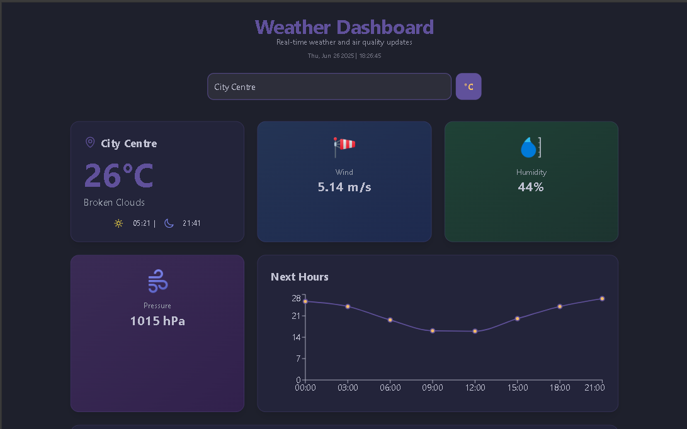

# 🌦️ Weather Dashboard

A sleek and fully responsive weather dashboard that provides live weather, air quality updates, and forecasts. Built with React and styled using Tailwind CSS.

### 🔗 Live Demo
👉 [View Live Site](https://askweb18.netlify.app/)

---

## 🚀 Features

- Current weather (temperature, wind, humidity, pressure)
- 5-day weather forecast
- Hour-by-hour temperature graph
- AQI (Air Quality Index) indicator
- City search & temperature unit toggle
- Fully responsive dark-mode layout

---

## 🧰 Tech Stack

- React
- Tailwind CSS
- Chart.js
- OpenWeatherMap API
- Vite

---

## 📸 Screenshot



---

## 📦 Getting Started

1. Clone the repo:
```bash
git clone https://github.com/abdulsalamkhan441/weather-app.git
